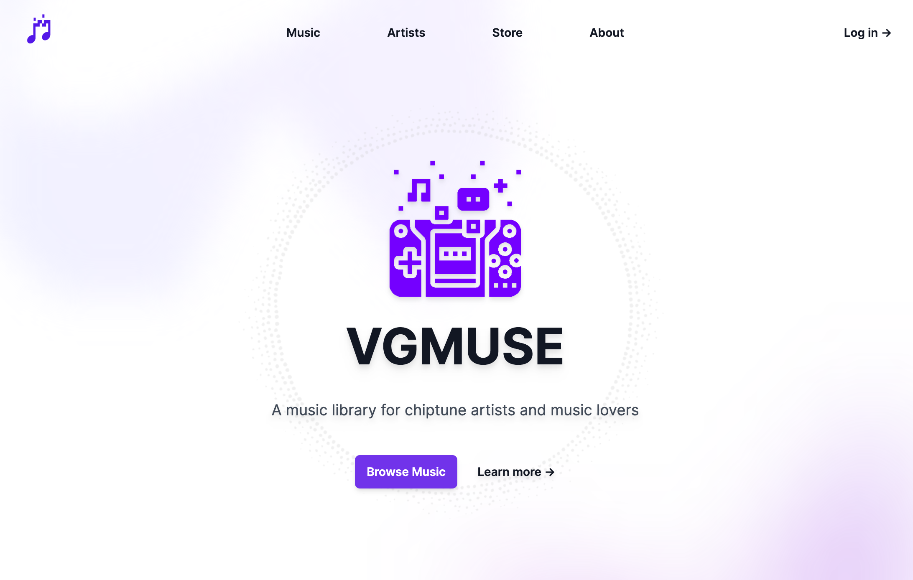
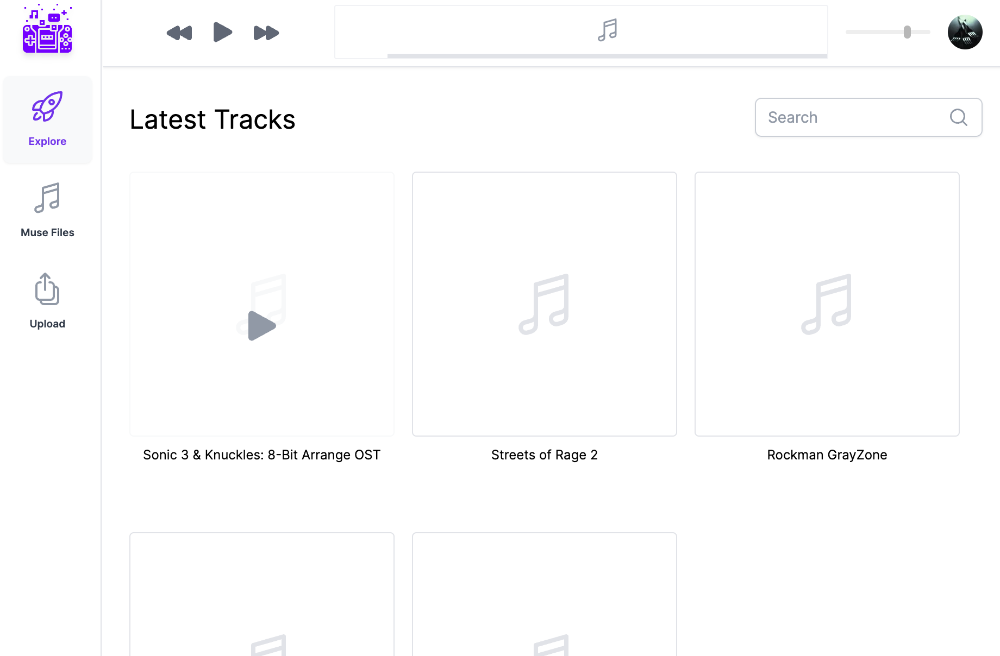
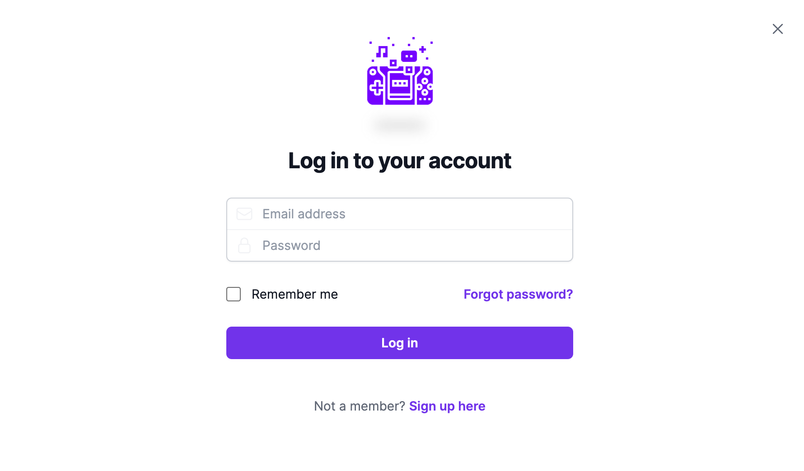

# VGMuse

Chiptune Music Library and Social Space @ [vgmuse.com](https://vgmuse.com)

## What is Chiptune?

In short, it's music that is created for various computer chips and sound processors found in old computers and video game consoles.

VGMuse uses an emulator to play back the container formats used by chiptune musicians. Some include *Nintendo Sound Format* for the Nintendo Entertainment System, and the *Game Boy Sound* Format.

## Features

### In-browser chiptune music playback and library

- Multi-format player (Game Boy, NES, SNES, etc.)
- Public uploads and track sharing

### Secure user authentication features

- JSON Web Token-based
- Email Verification
- Hardened Cookies
- User fingerprinting

## Technologies Used

Full-stack MERN app with a WebAssembly game audio library compiled via Emscripten

